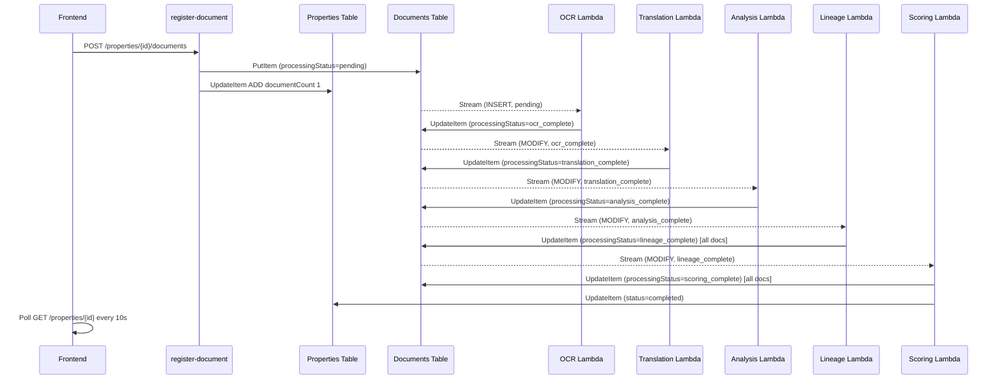

# Design Document: Document Pipeline Status

## Overview

This feature fixes end-to-end pipeline status tracking for property documents in SatyaMool. There are two distinct problems to solve:

1. **Document count bug**: `list-properties` returns `documentCount: 0` because it reads the field directly from the Properties table, but `register-document` never writes that field — it only creates a record in the Documents table.

2. **Pipeline progress tracking**: The frontend has no per-document, per-step progress data. The existing `processingStatus` string on each document record encodes the current step, but the backend never maps it to a structured `pipelineProgress` object, and the frontend has no component to render it.

The fix is surgical: add a `documentCount` atomic increment in `register-document`, add a `pipelineProgress` mapping in `get-property`, add a `getPipelineProgress` method to the frontend service, and update `PropertyDetails` to poll and render the 6-step progress bar.

---

## Architecture

The pipeline is event-driven. Each Lambda writes a terminal `processingStatus` to the Documents table, which triggers the next Lambda via DynamoDB Streams.



The `get-property` Lambda is the read path: it queries all documents for a property and maps each document's `processingStatus` to a `pipelineProgress` object before returning.

---

## Components and Interfaces

### Backend Changes

**`register-document.ts`** — add atomic documentCount increment after successful document PutItem:
```typescript
// After conditionalPut succeeds, atomically increment documentCount on the property
await docClient.send(new UpdateCommand({
  TableName: PROPERTIES_TABLE_NAME,
  Key: { propertyId },
  UpdateExpression: 'ADD documentCount :one',
  ExpressionAttributeValues: { ':one': 1 },
}));
```

**`get-property.ts`** — replace the existing `calculateProcessingStatus` with a new `mapToPipelineProgress` function that returns a structured `pipelineProgress` per document, and return a `documents` array in the response.

**`list-properties.ts`** — no change needed; it already reads `documentCount` from the Properties table. The fix is upstream in `register-document`.

### Processing Lambda Changes

Each processing Lambda already writes the correct terminal status. The gaps are:

- **Lineage Lambda**: currently calls `update_property_status(property_id, 'lineage_complete')` — this updates the *property*, not each document. It needs to also update each document's `processingStatus` to `lineage_complete`.
- **Scoring Lambda**: currently updates only the property status to `scoring_complete`. It needs to update each document's `processingStatus` to `scoring_complete` and set the property `status` to `completed`.

### Frontend Changes

**`property.ts`** — add new types and `getPipelineProgress` method:
```typescript
export type PipelineStepStatus = 'pending' | 'in_progress' | 'complete' | 'failed';

export interface PipelineProgress {
  upload: PipelineStepStatus;
  ocr: PipelineStepStatus;
  translation: PipelineStepStatus;
  analysis: PipelineStepStatus;
  lineage: PipelineStepStatus;
  scoring: PipelineStepStatus;
}

export interface DocumentWithPipeline extends Document {
  pipelineProgress: PipelineProgress;
}
```

**`PropertyDetails.tsx`** — update polling logic to check `pipelineProgress` step states instead of property-level status, and render the `DocumentPipelineProgress` component per document.

**New `DocumentPipelineProgress.tsx`** — renders a 6-step stepper for a single document.

---

## Data Models

### DynamoDB: SatyaMool-Documents

Existing fields (no schema change needed):

| Field | Type | Values |
|---|---|---|
| `documentId` | String (PK) | UUID |
| `propertyId` | String (SK) | UUID |
| `processingStatus` | String | See table below |
| `fileName` | String | |
| `fileSize` | Number | |
| `uploadedAt` | String | ISO 8601 |
| `updatedAt` | String | ISO 8601 |

`processingStatus` state machine:

```
pending
  → ocr_processing → ocr_complete → ocr_failed
                         → translation_processing → translation_complete → translation_failed
                                                        → analysis_processing → analysis_complete → analysis_failed
                                                                                   → lineage_complete → lineage_failed
                                                                                                          → scoring_complete → scoring_failed
```

### DynamoDB: SatyaMool-Properties

Add `documentCount` field (Number, default 0). Written atomically via `ADD documentCount 1` in `register-document`.

### API Response: GET /properties/{id}

New shape (additions highlighted):

```typescript
{
  propertyId: string;
  status: 'pending' | 'processing' | 'completed' | 'failed';
  documentCount: number;
  // NEW: replaces processingStatus percentage object
  documents: Array<{
    documentId: string;
    fileName: string;
    fileSize: number;
    processingStatus: string;
    uploadedAt: string;
    pipelineProgress: {          // NEW - always present, all 6 keys
      upload: PipelineStepStatus;
      ocr: PipelineStepStatus;
      translation: PipelineStepStatus;
      analysis: PipelineStepStatus;
      lineage: PipelineStepStatus;
      scoring: PipelineStepStatus;
    };
  }>;
}
```

### processingStatus → pipelineProgress Mapping

This is the core deterministic mapping function in `get-property.ts`:

| processingStatus | upload | ocr | translation | analysis | lineage | scoring |
|---|---|---|---|---|---|---|
| `pending` | complete | pending | pending | pending | pending | pending |
| `ocr_processing` | complete | in_progress | pending | pending | pending | pending |
| `ocr_complete` | complete | complete | pending | pending | pending | pending |
| `ocr_failed` | complete | failed | pending | pending | pending | pending |
| `translation_processing` | complete | complete | in_progress | pending | pending | pending |
| `translation_complete` | complete | complete | complete | pending | pending | pending |
| `translation_failed` | complete | complete | failed | pending | pending | pending |
| `analysis_processing` | complete | complete | complete | in_progress | pending | pending |
| `analysis_complete` | complete | complete | complete | complete | pending | pending |
| `analysis_failed` | complete | complete | complete | failed | pending | pending |
| `lineage_complete` | complete | complete | complete | complete | complete | pending |
| `lineage_failed` | complete | complete | complete | complete | failed | pending |
| `scoring_complete` | complete | complete | complete | complete | complete | complete |
| `scoring_failed` | complete | complete | complete | complete | complete | failed |
| *(unknown)* | pending | pending | pending | pending | pending | pending |

---

## Correctness Properties

*A property is a characteristic or behavior that should hold true across all valid executions of a system — essentially, a formal statement about what the system should do. Properties serve as the bridge between human-readable specifications and machine-verifiable correctness guarantees.*

### Property 1: Document registration increments count

*For any* property with a known `documentCount` N, successfully registering a new document via `register-document` must result in the property's `documentCount` becoming exactly N + 1.

**Validates: Requirements 1.1, 1.2, 5.1**

---

### Property 2: pipelineProgress is always structurally complete

*For any* document returned by `get-property`, the `pipelineProgress` object must be present and contain exactly the keys `upload`, `ocr`, `translation`, `analysis`, `lineage`, `scoring`, each with a value of `pending`, `in_progress`, `complete`, or `failed`.

**Validates: Requirements 2.1, 7.1, 7.2**

---

### Property 3: processingStatus → pipelineProgress mapping is deterministic and idempotent

*For any* valid `processingStatus` string, applying the mapping function produces the same `pipelineProgress` object every time (idempotent), and the result matches the mapping table exactly. Steps before the current step are `complete`, the current step is `in_progress` or `complete`, and steps after are `pending` (or `failed` if the status ends in `_failed`).

**Validates: Requirements 2.2, 2.3, 2.4, 2.5, 2.6, 2.7, 2.8, 2.9, 7.4**

---

### Property 4: Successful Lambda processing sets correct terminal status

*For any* document processed by a pipeline Lambda (OCR, Translation, Analysis, Lineage, Scoring), a successful run must write the corresponding terminal `processingStatus` to the Documents table: `ocr_complete`, `translation_complete`, `analysis_complete`, `lineage_complete`, or `scoring_complete` respectively.

**Validates: Requirements 3.1, 3.2, 3.3, 3.4, 3.5**

---

### Property 5: Failed Lambda processing sets correct failure status

*For any* document where a pipeline Lambda throws an unhandled exception, the Lambda must write the corresponding `_failed` status (`ocr_failed`, `translation_failed`, `analysis_failed`, `lineage_failed`, `scoring_failed`) to the Documents table.

**Validates: Requirements 3.6**

---

### Property 6: Lineage Lambda only processes when all documents are analysis_complete

*For any* property where at least one document does not have `processingStatus = analysis_complete`, the Lineage Lambda must skip processing that property and not write any lineage data.

**Validates: Requirements 3.7**

---

### Property 7: Scoring Lambda only processes when all documents are lineage_complete

*For any* property where at least one document does not have `processingStatus = lineage_complete`, the Scoring Lambda must skip processing that property and not write any trust score data.

**Validates: Requirements 3.8**

---

### Property 8: Property status is derived from document states

*For any* property, the `status` returned by `get-property` must reflect the current document states: `completed` only when all documents are `scoring_complete`, `failed` when any document has a `_failed` status and no in-progress documents remain, and `processing` otherwise.

**Validates: Requirements 4.1, 4.2, 4.3, 4.4**

---

### Property 9: Missing documentCount defaults to zero

*For any* property record that lacks a `documentCount` attribute, both `list-properties` and `get-property` must return `0` for that field rather than `null`, `undefined`, or an error.

**Validates: Requirements 1.4, 5.4**

---

### Property 10: Frontend polling stops when all steps are terminal

*For any* property where all documents have all 6 `pipelineProgress` steps in either `complete` or `failed` state, the `PropertyDetails` page must not schedule any further polling intervals.

**Validates: Requirements 6.6**

---

### Property 11: Pipeline step visual state matches pipelineProgress value

*For any* rendered document pipeline progress bar, each step's visual indicator must match its `pipelineProgress` value: `complete` → green/filled, `in_progress` → blue/animated, `failed` → red, `pending` → grey/outlined.

**Validates: Requirements 6.2, 6.3, 6.4, 6.5**

---

## Error Handling

**`register-document`**: The `ADD documentCount 1` update runs after the document PutItem. If the update fails, the document is registered but the count is stale. To handle this, the update should be retried up to 3 times. If it still fails, log a CloudWatch error for manual reconciliation. The document registration response is still 201 — the count is eventually consistent.

**`get-property`**: If the Documents table query fails, return a 500 with `INTERNAL_ERROR`. Never return a partial `pipelineProgress` object — if the mapping cannot be computed, default all steps to `pending`.

**`list-properties`**: If `documentCount` is missing from a property record, return `0`. Do not query the Documents table as a fallback (latency concern).

**Lineage Lambda**: If not all documents are `analysis_complete`, log at INFO level and return without processing. This is not an error — it's the expected guard condition.

**Scoring Lambda**: Same guard pattern as Lineage. If any document update to `scoring_complete` fails mid-loop, log the failure and continue updating remaining documents. Set property status to `failed` if any document could not be updated.

**Frontend polling**: If a `getProperty` call fails during polling, log the error and continue polling (do not stop the interval on transient errors). After 3 consecutive failures, stop polling and show an error banner.

---

## Testing Strategy

### Unit Tests

Focus on specific examples and edge cases:

- `mapToPipelineProgress`: test each row of the mapping table as a discrete example
- `register-document`: test that `documentCount` is incremented when a new document is registered, and not incremented on duplicate registration
- `get-property`: test that `pipelineProgress` is always present even for documents with unknown `processingStatus`
- `list-properties`: test that missing `documentCount` returns 0
- `DocumentPipelineProgress` component: snapshot tests for each step state combination
- `PropertyDetails` polling: test that interval is cleared when all steps are terminal

### Property-Based Tests

Use [fast-check](https://github.com/dubzzz/fast-check) for TypeScript and [Hypothesis](https://hypothesis.readthedocs.io/) for Python.

Each property test must run a minimum of 100 iterations.

Tag format: `Feature: document-pipeline-status, Property {N}: {property_text}`

**Property 1** — `register-document` count increment:
Generate a random initial `documentCount` (0–1000) and a random valid document registration payload. Verify the count after registration equals initial + 1.
```
// Feature: document-pipeline-status, Property 1: document registration increments count
```

**Property 2** — `pipelineProgress` structural completeness:
Generate random `processingStatus` strings (valid and invalid). For every input, verify the returned object has exactly the 6 required keys and each value is one of the 4 valid states.
```
// Feature: document-pipeline-status, Property 2: pipelineProgress is always structurally complete
```

**Property 3** — mapping idempotence:
Generate random `processingStatus` strings. Apply the mapping function twice and verify both results are deeply equal.
```
// Feature: document-pipeline-status, Property 3: processingStatus → pipelineProgress mapping is deterministic and idempotent
```

**Property 4 & 5** — Lambda terminal status writes:
Generate random document payloads. Mock AWS clients. Verify the DynamoDB UpdateItem call writes the correct `processingStatus` on success and the correct `_failed` status on exception.
```
# Feature: document-pipeline-status, Property 4: successful Lambda processing sets correct terminal status
# Feature: document-pipeline-status, Property 5: failed Lambda processing sets correct failure status
```

**Property 6 & 7** — Lineage/Scoring guard conditions:
Generate random sets of documents with mixed `processingStatus` values. Verify the Lambda skips processing when the guard condition is not met.
```
# Feature: document-pipeline-status, Property 6: Lineage Lambda only processes when all documents are analysis_complete
# Feature: document-pipeline-status, Property 7: Scoring Lambda only processes when all documents are lineage_complete
```

**Property 8** — derived property status:
Generate random collections of documents with random `processingStatus` values. Verify the derived property status matches the expected value based on the document states.
```
// Feature: document-pipeline-status, Property 8: property status is derived from document states
```

**Property 10** — polling stops on terminal state:
Generate random `pipelineProgress` objects where all steps are `complete` or `failed`. Render `PropertyDetails` and verify no `setInterval` is active after the first render cycle.
```
// Feature: document-pipeline-status, Property 10: frontend polling stops when all steps are terminal
```

**Property 11** — visual state matches data:
Generate random `PipelineStepStatus` values. Render `DocumentPipelineProgress` and verify each step's CSS class/color matches the expected visual state for that value.
```
// Feature: document-pipeline-status, Property 11: pipeline step visual state matches pipelineProgress value
```
